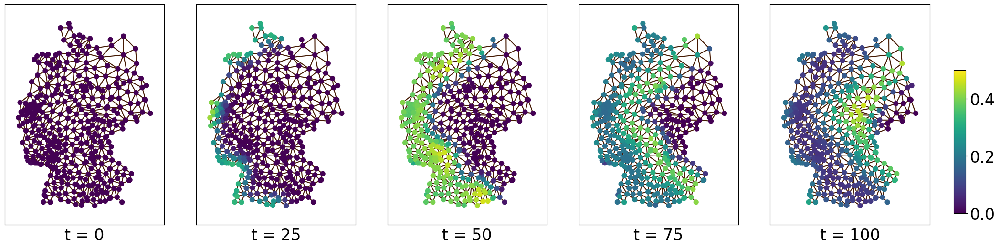

# Temporal Waves on Graphs

## Reference
DOI: ? Bibtex: ? 

## Execution

### Requirements
Installation of *deal.ii* using official 
[deal.ii installation](https://dealii.org/download.html). As this is tested on 
Ubuntu, this can be done with

```
apt-get install libdeal.ii-dev
```


### Running the Simulation

1. ``` cd pde_solver/wave_equation/ ```
2. ``` cmake . ```
3. ``` make run ```

### Using the results

Running the simulation as described above will result in multiple CSVs and .vtk
 files, named after the simulation and its respective timestep. VKT files can be
 visualized with 
[ParaView](https://gitlab.kitware.com/paraview/paraview/-/tree/master). The CSVs
 have to be concatenated to form a new dataset, as for every time-step one CSV is
 generated.

## Data Usage (without execution)
The data can be loaded and used with only numpy.
Executing the following numpy code

```
import numpy as np
a = np.load("364_25_numpy_dataset.npy")
print(a.shape)
```
will reveal the dataset has a shape of ``` (9100, 400, 2) ``` which refers
to 9100 timesteps, 400 locations/nodes/NUTS3 regions, and two values: 
Susceptible and Infected.

The Nodes are the alphabetically ordered NUTS3 regions. Their 
adjacencies and distances can be found in the file ```data/adjacency/nuts3_adjacent_distances.pt```, 
which can directly loaded as a PyTorch tensor with the
following code:


```
dist = torch.load("nuts3_adjacent_distances.pt").T
edge_index = dist[:2, :].int()
dist = dist[2,:]
```

will return an edge_index of 2088 connection, and their distances. 

### Training and Evaluating the Models from the Paper

You can use Python version 3.9 for the environment, later versions should also work but we cannot guarantee it.
To start, you can create a virtual environment in the directory ```ml``` and install the required packages by running  ```pip install -r ./requirements.txt```

In order to start a training process, simply run any of the training scripts with ```python train_<model_name>.py```.

Model definitions can be found in `ml/models.py`. You can set the hyperparameters and other training-related variables by modifying the corresponding configuration file: `ml/config/<model_name>.yml`.
In the configuration, you have the option to set `num_eval_runs` and `num_train_runs` to adjust for randomization effects, such as initialization for training and the dataset noise for evaluation.

When the training process finishes; the model, loss plot, and branch plot will be saved into a directory named `<model_name>_<run_number>_<training_dataset>`. 

After training, you can run the evaluation scripts with: ```python evaluate_<model_name>.py```

When the evaluation scripts finish, the day-specific losses will be written to a file named `<model_name>_<eval_dataset>_daily_losses`.


## License

Note, that the [deal.ii](https://dealii.org/) library is licensed under GNU LESSER GENERAL261
PUBLIC LICENSE v2.1 and has to be cited accordingly.

Our code is also licensed with the GNU LESSER GENERAL261 PUBLIC LICENSE v2.1.
Our datasets are published under the CC BY 4.0 license.
